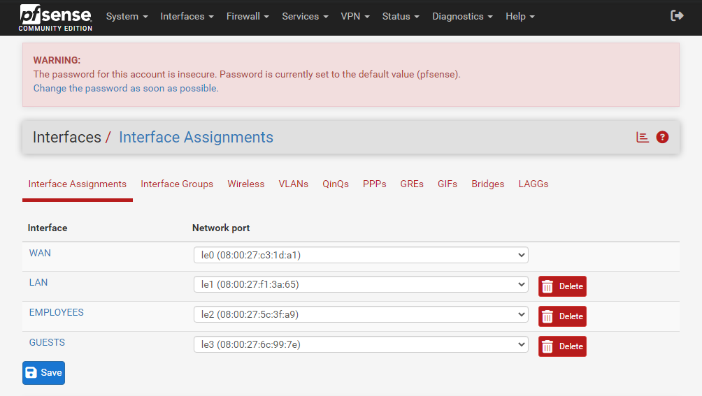
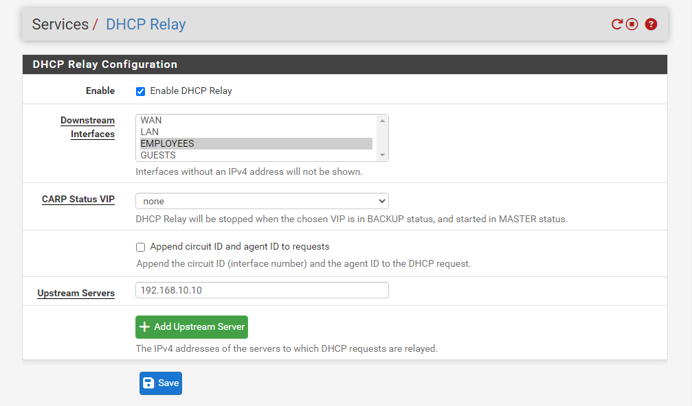

# Konfiguracja VLAN — pfSense

## Interfejsy
| Interfejs | Opis | Adres IP | Sieć |
|-----------|------|----------|------|
| WAN | Internet (ISP) | DHCP | - |
| LAN | Sieć serwerów | 192.168.10.1/24 | VLAN 10 |
| EMPLOYEES | Sieć pracowników | 192.168.20.1/24 | VLAN 20 |
| GUESTS | Sieć gości | 192.168.30.1/24 | VLAN 30 |

## DHCP Relay
Zapytania DHCP z VLAN 20 i VLAN 30 są przekazywane 
do Windows Server (192.168.10.10) przez DHCP Relay.
Windows Server centralnie zarządza pulami adresów IP 
dla wszystkich VLAN-ów.

| VLAN | Pula DHCP | Serwer DHCP |
|------|-----------|-------------|
| 10 | 192.168.10.100-200 | Windows Server |
| 20 | 192.168.20.100-200 | Windows Server (przez Relay) |
| 30 | 192.168.30.100-200 | Windows Server (przez Relay) |

## Screenshoty

