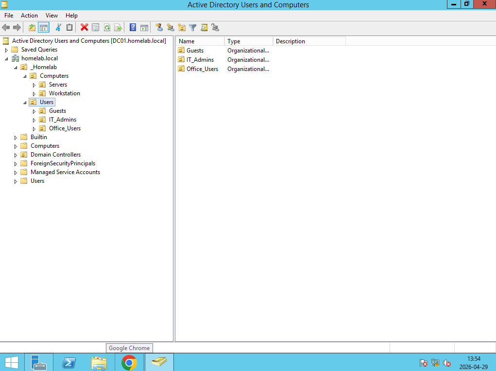
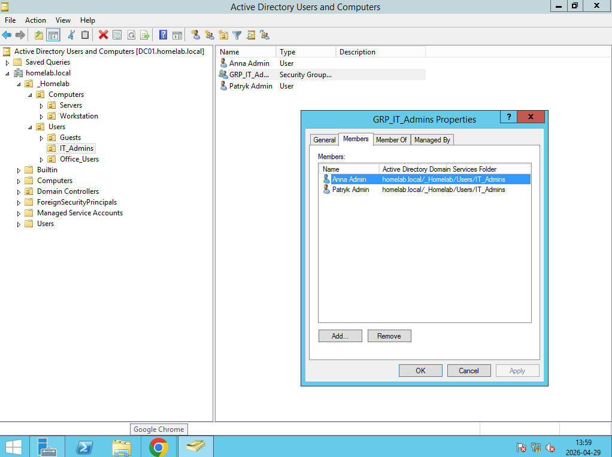
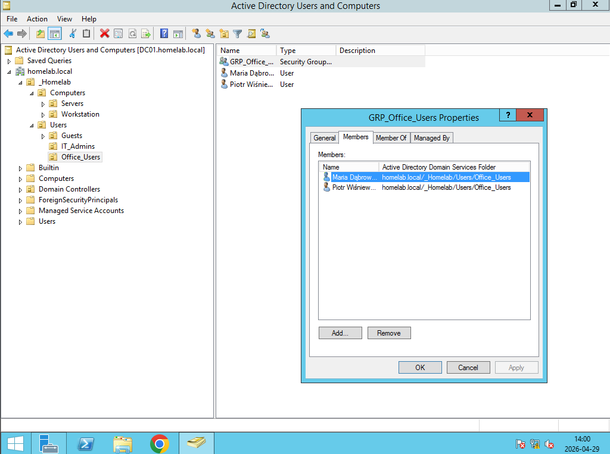
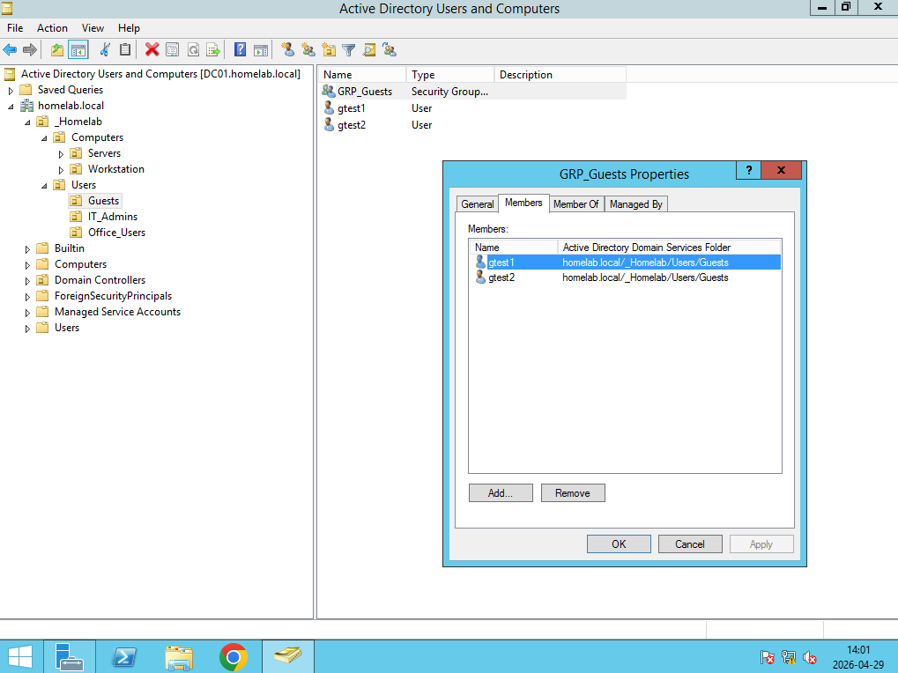

# Struktura Active Directory

## Informacje o domenie
| Parametr | Wartość |
|----------|---------|
| Nazwa domeny | homelab.local |
| NetBIOS | HOMELAB |
| Kontroler domeny | DC01 |
| Adres IP DC | 192.168.10.10 |
| Poziom funkcjonalności | Windows Server 2016 |

## Struktura OU
homelab.local
└── _Homelab
    ├── Users
    │   ├── IT_Admins
    │   ├── Office_Users
    │   └── Guests
    └── Computers
        ├── Workstations
        └── Servers

## Grupy bezpieczeństwa
| Grupa | OU | Opis |
|-------|----|------|
| GRP_IT_Admins | IT_Admins | Administratorzy IT |
| GRP_Office_Users | Office_Users | Pracownicy biurowi |
| GRP_Guests | Guests | Goście |

## Konta użytkowników
| Użytkownik | Login | Grupa | Rola |
|------------|-------|-------|------|
| Patryk Admin | patrykadmin | GRP_IT_Admins | Administrator IT |
| Anna Admin | annaadmin | GRP_IT_Admins | Administrator IT |
| Piotr Wiśniewski | pwisniewski | GRP_Office_Users | Pracownik biurowy |
| Maria Dąbrowska | mdabrowska | GRP_Office_Users | Pracownik biurowy |
| gtest1 | gtest1 | GRP_Guests | Gość |
| gtest2 | gtest2 | GRP_Guests | Gość |

## Screenshoty

