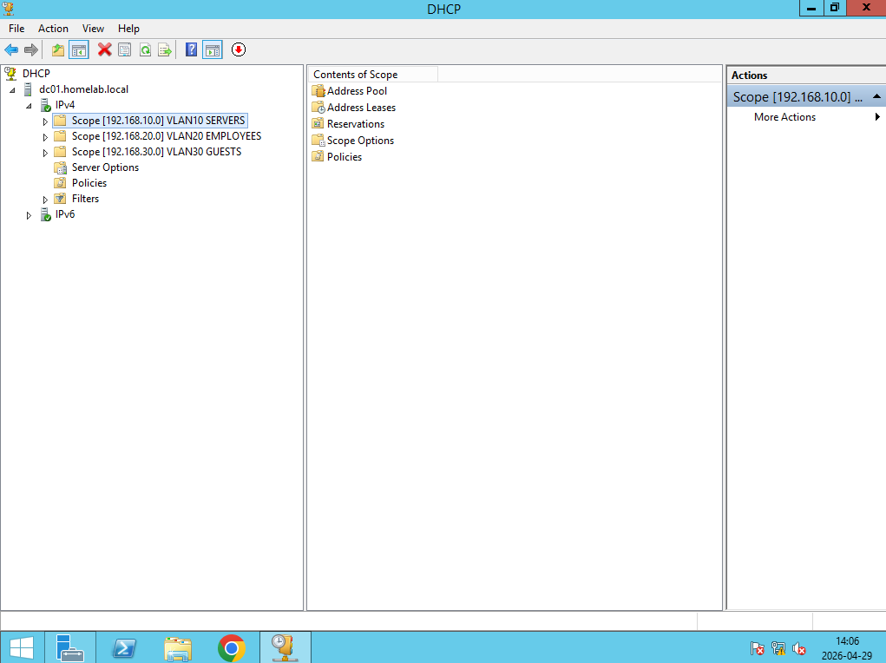
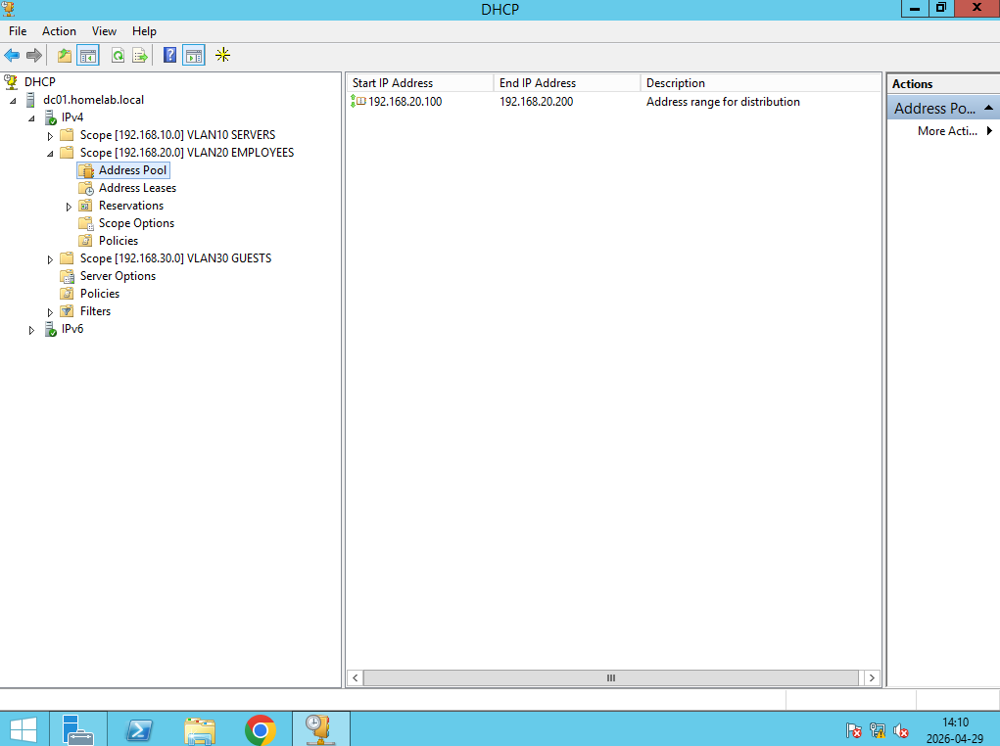

# Konfiguracja DHCP

## Serwer DHCP
Windows Server 2012 pełni rolę centralnego serwera DHCP 
dla wszystkich VLAN-ów. Zapytania z VLAN 20 i VLAN 30 
są przekazywane przez DHCP Relay skonfigurowany w pfSense.

## Zakresy DHCP
| Zakres | Podsieć | Pula adresów | Brama | DNS |
|--------|---------|--------------|-------|-----|
| VLAN10 Servers | 192.168.10.0/24 | .100 - .200 | 192.168.10.1 | 192.168.10.10 |
| VLAN20 Employees | 192.168.20.0/24 | .100 - .200 | 192.168.20.1 | 192.168.10.10 |
| VLAN30 Guests | 192.168.30.0/24 | .100 - .200 | 192.168.30.1 | 1.1.1.1 |

## Czas dzierżawy
- VLAN 10 i 20: 8 godzin
- VLAN 30: 8 godziny

## Screenshoty

