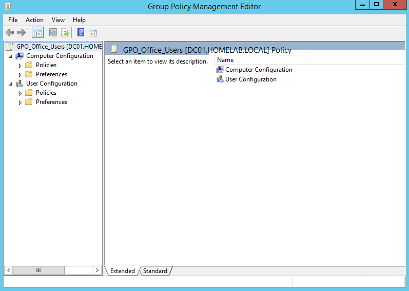
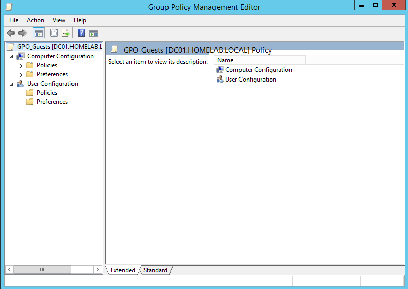
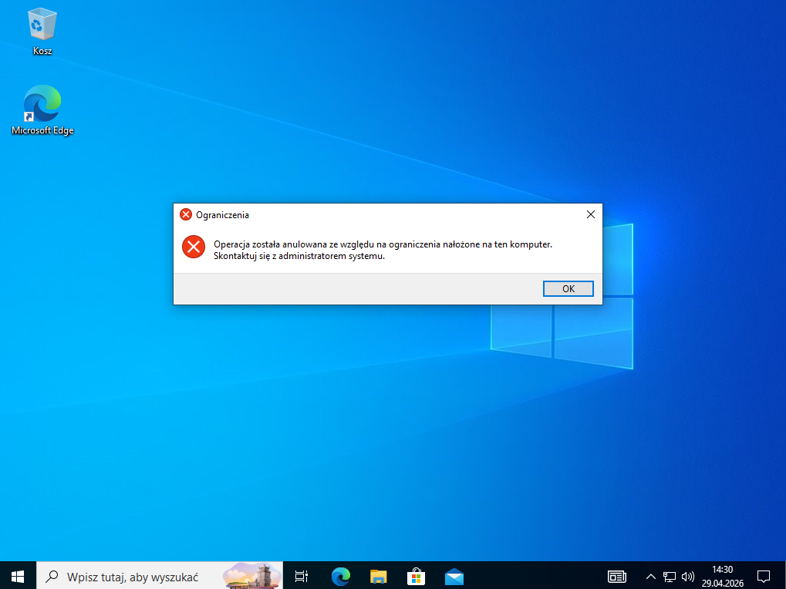
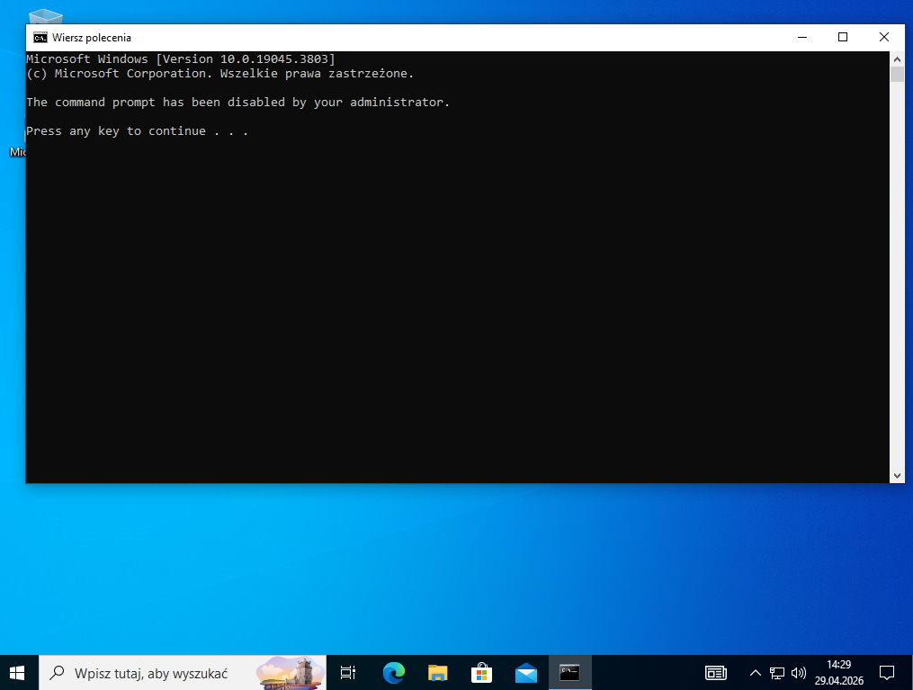

# Konfiguracja GPO

## Przegląd polityk
| GPO | Powiązana OU | Grupa | Priorytet |
|-----|-------------|-------|-----------|
| GPO_IT_Admins | IT_Admins | GRP_IT_Admins | 1 |
| GPO_Office_Users | Office_Users | GRP_Office_Users | 1 |
| GPO_Guests | Guests | GRP_Guests | 1 |

## GPO_IT_Admins
Polityka dla administratorów IT — minimalne ograniczenia.

| Ustawienie | Ścieżka | Wartość |
|------------|---------|---------|
| Zezwól na RDP | Computer Config → Admin Templates → Remote Desktop | Enabled |
| Task Manager | User Config → Admin Templates → System | Not Configured |

## GPO_Office_Users
Polityka dla pracowników biurowych — standardowe ograniczenia.

| Ustawienie | Ścieżka | Wartość |
|------------|---------|---------|
| Blokada Panelu Sterowania | User Config → Admin Templates → Control Panel | Enabled |
| Blokada CMD | User Config → Admin Templates → System | Enabled |
| Ekran blokady | User Config → Admin Templates → Personalization | 600 sekund |
| Hasło ekranu blokady | User Config → Admin Templates → Personalization | Enabled |

## GPO_Guests
Polityka dla gości — maksymalne ograniczenia.

| Ustawienie | Ścieżka | Wartość |
|------------|---------|---------|
| Blokada Panelu Sterowania | User Config → Admin Templates → Control Panel | Enabled |
| Blokada CMD | User Config → Admin Templates → System | Enabled |
| Blokada Task Managera | User Config → Admin Templates → Ctrl+Alt+Del | Enabled |
| Ekran blokady | User Config → Admin Templates → Personalization | 300 sekund |

## Weryfikacja
Polityki zweryfikowane komendą gpresult /r na stacji roboczej.
Wynik — Applied Group Policy Objects zawiera odpowiednie GPO.

## Screenshoty

